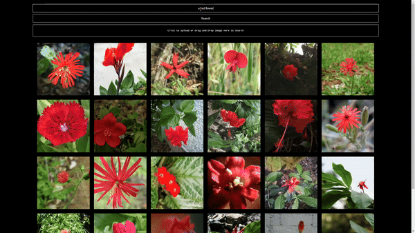

## ⚠️ **Warning:** This project is under active development and may undergo significant changes.

# Personal Image Search Engine



## To-Do

- [ ] Find a suitable name for the project.
- [ ] Load image paths from `filelist.txt`.
- [ ] Integrate Face Detection Engine.
- [ ] Vector database merging funcitions needed.
- [ ] Add image to text decoder
- [ ] Dataset preperations scripts.
  - [ ] Tutorials and descriptive ipynb notebooks.
- [ ] Make database and table connections generic.
  - [ ] Could be selectable from ui?
- [ ] Webui Pagination for more images.
- [x] Configure everything with yaml file.
- [x] Enable multiprocessing for image reading.
- [x] Implement multi-GPU support for embedding calculations.
- [x] Save embeddings in a designated folder (create if not exists).
- [x] Implement a FastAPI-based interface.
- [x] Build a web app.
- [x] Create a Dockerfile for easy deployment.
- [x] Migrate the database to LanceDB.
- [x] Separate logging functionality for better modularity.
- [x] Integrate LanceDB with the web app.
- [x] Fix batch processing in embedding calculations using `torch.stack()`.

## Benchmarks

**Performance**:

- NVIDIA A100 **151.8 images per second**
- NVIDIA 3090 Ti **80.3 images per second**

## Usage

### Windows

Run the following script:

```bash
start_server.bat
```

### Linux/macOS

First, ensure the script has executable permissions:

```bash
chmod +x start_server.sh
```

Then run it:

```bash
./start_server.sh
```

## Known Issues

### lib40ml Problem

In case you encounter issues related to `lib40ml`, you can resolve them by setting the following environment variable in your code:

```python
os.environ["KMP_DUPLICATE_LIB_OK"] = "TRUE"
```

## Docker

You can build and run the project using Docker:

```bash
docker build -t personal-image-search .
docker run -p 7777:7777 personal-image-search
```

Alternatively, using Docker Compose:

```bash
docker-compose up --build
```
